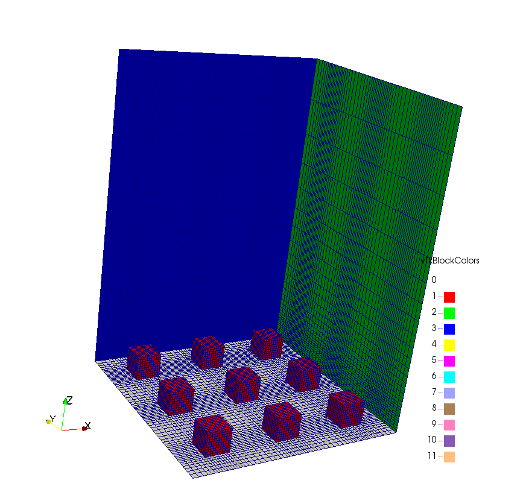
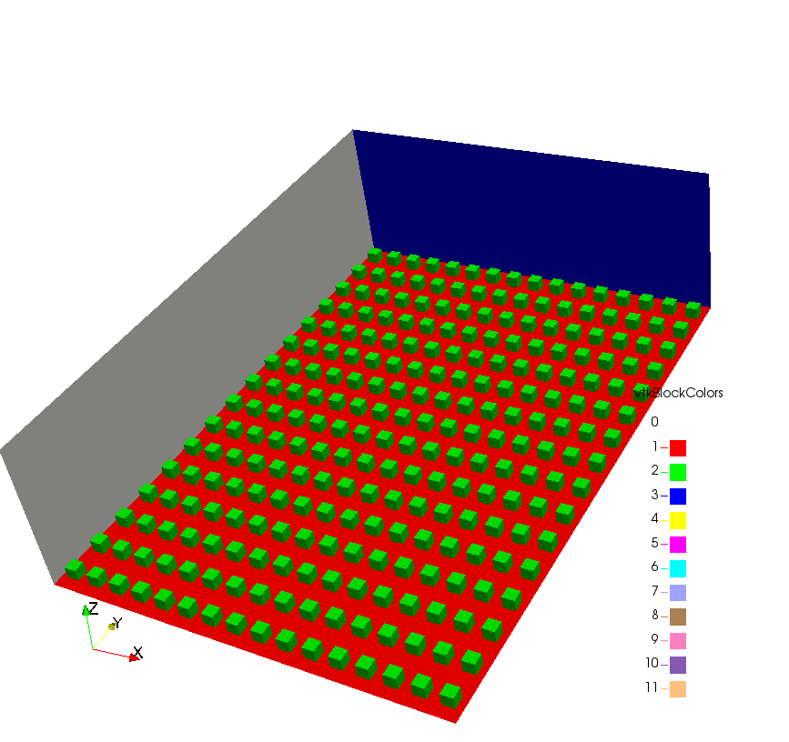

# OpenFOAM-repeatMesh
Repeats a `blockMesh` grid to have x `*` y `*` z instances of the original grid.
The number of instances (x, y, z) in one direction is equal to the number of repetitions in that direction minus one.

The cell faces at the boundaries of the original `blockMesh` grid must match in order to successfully repeat the mesh.

This software was developed and tested using the [OpenFOAM-4.x](https://github.com/OpenFOAM/OpenFOAM-4.x) open source CFD toolbox from OpenFOAM Foundation.


## Usage

```sh
repeatMesh.sh [OPTIONS]
```


## Options

```sh
  -x <integer>      number of instances in X direction
  -y <integer>      number of instances in Y direction
  -z <integer>      number of instances in Z direction
  -no-blockMesh     do not run blockMesh
  -dict <file>      specify alternative dictionary for the blockMesh description
  -region <name>    specify alternative mesh region
  -help             print the usage
```


# Example case `example_repeatMesh`

The example case was based on the `turbineSiting` tutorial available in [OpenFOAM-4.x](https://github.com/OpenFOAM/OpenFOAM-4.x), located at `$FOAM_TUTORIALS/incompressible/simpleFoam/turbineSiting`, without `snappyHexMesh` refinement.

To run, load OpenFOAM environment variables and run `genMesh.sh`.  Assuming OpenFOAM is installed at `/opt/openfoam/OpenFOAM-4.x`, the following instructions will generate an 3x5 array of wall mounted cubes from a single cube whose mesh is specified at `system/blockMeshDict`:
```sh
source /opt/openfoam/OpenFOAM-4.x/etc/bashrc

cd example_repeatMesh

./genMesh.sh
```
which is being controlled at the last line in `genMesh.sh` script, namely:
```sh
../repeatMesh.sh -no-blockMesh -x 3 -y 5
```

Examples of a [3x3](exemplo3x3.png) and [16x16](exemplo16x16.png) arrays are shown below.





## Copyright notice

Copyright (C) 2018 by Carlos Veiga Rodrigues <cvrodrigues@gmail.com>. All rights reserved.

This program is free software: you can redistribute it and/or modify
it under the terms of the GNU General Public License as published by
the Free Software Foundation, either version 3 of the License, or
(at your option) any later version.

This program is distributed in the hope that it will be useful,
but WITHOUT ANY WARRANTY; without even the implied warranty of
MERCHANTABILITY or FITNESS FOR A PARTICULAR PURPOSE.  See the
GNU General Public License for more details.

For more details consult the GNU General Public License at:
<http://www.gnu.org/licenses/gpl.html>.

